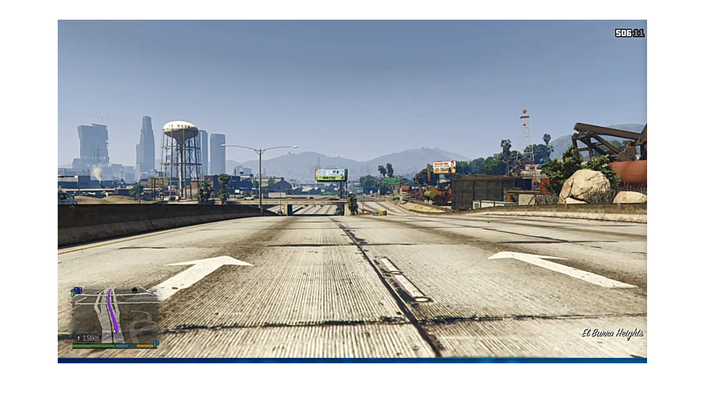

# Training data 


More on [https://github.com/slevin48/gta](https://github.com/slevin48/gta) 


# Data access
## Get images

```matlab:Code
training_dataset = "2021-03-01-2";
training_data_0 = imread("D:\devel\AI-workflow\samples\"+training_dataset+"\img_0.png");
imshow(training_data_0)
```





```matlab:Code
length(ls("D:\devel\AI-workflow\samples\"+training_dataset))
```


```text:Output
ans = 944
```


```matlab:Code
i = 212;
training_img = imread("D:\devel\AI-workflow\samples\"+training_dataset+"\img_"+string(i)+".png");
imshow(training_img)
```


  

```matlab:Code
data = readtable("D:\devel\AI-workflow\samples\"+training_dataset+"\data.csv");
data = renamevars(data,["Var1","Var2","Var3","Var4","Var5","Var6"],["img", "x", "y", "r", "l", "b"]);
data
```

| |img|x|y|r|l|b|
|:--:|:--:|:--:|:--:|:--:|:--:|:--:|
|1|'samples/2021-03-01-...|-0.0157|0|0|0|0|
|2|'samples/2021-03-01-...|-0.0157|0|0|0|0|
|3|'samples/2021-03-01-...|-0.0157|0.0079|0.1289|0|0|
|4|'samples/2021-03-01-...|-0.1496|0.0709|0.9961|0|0|
|5|'samples/2021-03-01-...|0|-0.0079|0.9961|0|0|
|6|'samples/2021-03-01-...|-0.0079|-0.0236|0.9961|0|0|
|7|'samples/2021-03-01-...|0.2205|-0.0787|0.9961|0|0|
|8|'samples/2021-03-01-...|-0.0709|-0.0157|0.9961|0|0|
|9|'samples/2021-03-01-...|-0.0079|-0.0315|0.9961|0|0|
|10|'samples/2021-03-01-...|0|-0.0157|0.9961|0|0|
|11|'samples/2021-03-01-...|-0.0709|-0.0472|0.9961|0|0|
|12|'samples/2021-03-01-...|0.0079|0|0.9961|0|0|
|13|'samples/2021-03-01-...|0|0.0472|0.9961|0|0|
|14|'samples/2021-03-01-...|0.0079|0|0.9961|0|0|


```matlab:Code
plot(data.x)
```


## Get data from Numpy directly

```matlab:Code
pyenv
```


```text:Output
ans = 
  PythonEnvironment with properties:

          Version: "3.9"
       Executable: "C:\Users\badmo\AppData\Local\Programs\Python\Python39\python.EXE"
          Library: "C:\Users\badmo\AppData\Local\Programs\Python\Python39\python39.dll"
             Home: "C:\Users\badmo\AppData\Local\Programs\Python\Python39"
           Status: Loaded
    ExecutionMode: InProcess
        ProcessID: "17248"
      ProcessName: "MATLAB"

```


```matlab:Code
training_dir = uigetdir
```


```text:Output
training_dir = 'D:\devel\AI-workflow\data'
```


```matlab:Code
% training_dataset"training_data-2021-02-12-2"
% training_dir = "training_data\"+training_dataset
```


```matlab:Code
npfiles = dir(training_dir+"\*.npy")
```

|Fields|name|folder|date|bytes|isdir|datenum|
|:--:|:--:|:--:|:--:|:--:|:--:|:--:|
|1|'X.npy'|'D:\\devel\\AI-workf...|'02-mars-2021 09:56:...|85536128|0|7.3822e+05|
|2|'y.npy'|'D:\\devel\\AI-workf...|'02-mars-2021 09:56:...|10928|0|7.3822e+05|


```matlab:Code
length(npfiles)
```


```text:Output
ans = 2
```


```matlab:Code
npdata = py.training_data.load_data(training_dir+"/X.npy")
```


```text:Output
npdata = 
  Python list with no properties.

    [array([[0.40701129, 0.37865122, 0.29349376],
           [0.31666667, 0.30123589, 0.25591206],
           [0.34851456, 0.35433749, 0.29405823],
           [0.36590018, 0.38597742, 0.28354724],
           [0.3840404 , 0.39894236, 0.2885205 ],
           [0.34439097, 0.34327986, 0.26043375],
           [0.35573381, 0.37345811, 0.29399881],
           [0.35876411, 0.37058824, 0.28184789],
           [0.46449198, 0.48158051, 0.35580511],
           [0.41984551, 0.40494355, 0.30286393],
           [0.4778669 , 0.47322638, 0.35013072],
           [0.58135472, 0.57118835, 0.41684492],
           [0.70695187, 0.67557932, 0.46723113],
           [0.69425431, 0.65300059, 0.47745098],
           [0.65244801, 0.61453357, 0.49044563],
           [0.58749851, 0.57272133, 0.4414082 ],
           [0.4732145 , 0.46057635, 0.3579798 ],
           [0.33169935, 0.33562092, 0.27489602],
           [0.37668449, 0.42884135, 0.37550802],
           [0.61964944, 0.65438503, 0.52278669],
           [0.61116459, 0.59426025, 0.43910873],
           [0.66529412, 0.65164587, 0.47346999],
           [0.65680333, 0.63770053, 0.46565657],
           [0.49808675, 0.48938206, 0.37948901],
           [0.34647653, 0.35611408, 0.31506239],
           [0.27210933, 0.31093286, 0.298776  ],
           [0.27411765, 0.31175282, 0.30478313],
           [0.27299465, 0.30632799, 0.27982769],
           [0.27269756, 0.3024896 , 0.27199049],
           [0.20705882, 0.24235294, 0.221735  ],
           [0.21199049, 0.24728461, 0.22404635],
           [0.18666667, 0.22095068, 0.2004694 ],
           [0.17204397, 0.1926025 , 0.19310755],
           [0.19904932, 0.19206774, 0.19481283],
           [0.33367796, 0.292959  , 0.26433155],
           [0.52710042, 0.44524064, 0.36497326],
           [0.59632204, 0.50436126, 0.39657754],
           [0.50095068, 0.40347594, 0.32504456],
           [0.43832442, 0.36207962, 0.29950089],
           [0.39182412, 0.34214498, 0.29456922],
           [0.32982175, 0.27884135, 0.26136067],
           [0.39138443, 0.3375104 , 0.33633393],
           [0.3       , 0.28672014, 0.30291147],
           [0.25250743, 0.28985146, 0.29808675],
           [0.43535354, 0.46934641, 0.39248366],
           [0.51731432, 0.53731432, 0.38858586],
           [0.34493167, 0.35991087, 0.23960784],
           [0.35154486, 0.36919192, 0.28879976],
           [0.40984551, 0.42827689, 0.34239453],
           [0.57155674, 0.57910873, 0.4374391 ],
           [0.46396316, 0.46788473, 0.33013666],
           [0.42008913, 0.4240107 , 0.30565657],
           [0.51238859, 0.52023173, 0.38980986],
           [0.41625668, 0.42135472, 0.32583482],
           [0.23682115, 0.25944147, 0.21316696],
           [0.32788473, 0.37001188, 0.2989899 ],
           [0.56102198, 0.58720737, 0.427041  ],
           [0.59322638, 0.58000594, 0.41333928],
           [0.52455734, 0.50683304, 0.3659596 ],
           [0.69423054, 0.65262032, 0.52128936],
           [0.47954248, 0.44418301, 0.33679739],
           [0.33042187, 0.33199049, 0.24846108],
           [0.41770648, 0.44022579, 0.35249554],
           [0.37456922, 0.40828283, 0.32405823],
           [0.3502139 , 0.37374332, 0.32746881],
           [0.48291147, 0.54408794, 0.57612002],
           [0.74117647, 0.82745098, 0.90862745],
           [0.7372549 , 0.82745098, 0.90784314],
           [0.73333333, 0.82352941, 0.91372549],
           [0.73333333, 0.82352941, 0.91372549],
           [0.73333333, 0.82352941, 0.91764706],
           [0.73333333, 0.82352941, 0.91764706],
           [0.73333333, 0.82352941, 0.91764706],
           [0.72941176, 0.81960784, 0.91372549],
           [0.72941176, 0.81960784, 0.91372549],
           [0.72941176, 0.81960784, 0.91372549],
           [0.73144979, 0.81960784, 0.91372549],
           [0.73333333, 0.81960784, 0.91372549],
           [0.73333333, 0.81960784, 0.91372549],
           [0.73333333, 0.81960784, 0.91372549],
           [0.73333333, 0.81960784, 0.91372549],
           [0.73333333, 0.81960784, 0.91372549],
           [0.7254902 , 0.82106358, 0.91372549],
           [0.7254902 , 0.82251931, 0.91372549],
           [0.73333333, 0.82352941, 0.91473559],
           [0.73333333, 0.82352941, 0.91473559],
           [0.73333333, 0.82078431, 0.91473559],
           [0.73333333, 0.81960784, 0.91372549],
           [0.73333333, 0.82352941, 0.91254902],
           [0.73333333, 0.82392157, 0.90980392],
           [0.7372549 , 0.83137255, 0.90879382],
           [0.74117647, 0.82745098, 0.90879382],
           [0.75490196, 0.84016637, 0.91960784],
           [0.77254902, 0.84517528, 0.9254902 ],
           [0.76761735, 0.82705882, 0.91333333],
           [0.7562448 , 0.81960784, 0.89058824],
           [0.7334997 , 0.81859774, 0.90557932],
           [0.72106358, 0.81714201, 0.90980392],
           [0.72565657, 0.81890077, 0.91781343],
           [0.74045752, 0.81960784, 0.91764706],
           [0.74699941, 0.82222816, 0.91634581],
           [0.74408794, 0.82644088, 0.9244801 ],
           [0.75193108, 0.83036245, 0.91859774],
           [0.73506833, 0.81960784, 0.90007724],
           [0.72980392, 0.81960784, 0.89803922],
           [0.75215686, 0.82614973, 0.90458111],
           [0.79301842, 0.85372549, 0.92823529],
           [0.80291147, 0.85882353, 0.93333333],
           [0.78517528, 0.85184195, 0.92039216],
           [0.75254902, 0.83098039, 0.90286988],
           [0.74117647, 0.82090909, 0.89934046],
           [0.73333333, 0.81568627, 0.90078431],
           [0.73232323, 0.81568627, 0.90196078],
           [0.73262626, 0.81686275, 0.90313725],
           [0.74901961, 0.82352941, 0.91372549],
           [0.74901961, 0.82352941, 0.9128164 ],
           [0.74509804, 0.82714795, 0.90588235],
           [0.74509804, 0.8254902 , 0.90588235],
           [0.73607843, 0.81568627, 0.89803922],
           [0.73333333, 0.81568627, 0.90588235],
           [0.73333333, 0.81215686, 0.90980392],
           [0.73333333, 0.81568627, 0.90980392],
           [0.7372549 , 0.81568627, 0.90980392],
           [0.73812834, 0.81960784, 0.90980392],
           [0.74117647, 0.82262032, 0.90980392],
           [0.74509804, 0.82745098, 0.91372549],
           [0.74117647, 0.82078431, 0.90980392],
           [0.73921569, 0.81960784, 0.90980392],
           [0.7372549 , 0.81960784, 0.90980392],
           [0.73754605, 0.82352941, 0.92166964],
           [0.72165181, 0.79655377, 0.88724302],
           [0.62361854, 0.68824718, 0.74925728],
           [0.48247178, 0.52510398, 0.57222222],
           [0.49488414, 0.52045157, 0.53275698],
           [0.56822935, 0.59175876, 0.59316102],
           [0.65692216, 0.684082  , 0.71658942],
           [0.68850267, 0.72771836, 0.77304219],
           [0.62471777, 0.65659537, 0.67284611],
           [0.6897861 , 0.7063161 , 0.70323827],
           [0.72790255, 0.74207962, 0.73311943],
           [0.74018419, 0.77972668, 0.81334522],
           [0.7559893 , 0.81143197, 0.8792454 ],
           [0.75294118, 0.82308378, 0.90106952],
           [0.75381462, 0.82541295, 0.908776  ],
           [0.75193108, 0.82745098, 0.91372549],
           [0.74901961, 0.82392157, 0.91372549],
           [0.74901961, 0.82352941, 0.91372549],
           [0.74901961, 0.82352941, 0.91372549],
           [0.75193108, 0.82745098, 0.91372549],
           [0.75294118, 0.82745098, 0.91411765],
           [0.76039216, 0.82745098, 0.91764706],
           [0.76078431, 0.82745098, 0.91764706],
           [0.76078431, 0.82745098, 0.91764706],
           [0.76470588, 0.82745098, 0.91372549],
           [0.76470588, 0.82745098, 0.90980392],
           [0.76862745, 0.8300713 , 0.91372549],
           [0.76862745, 0.83106952, 0.91372549],
           [0.76862745, 0.83137255, 0.91372549],
           [0.76862745, 0.83137255, 0.91372549],
           [0.76862745, 0.83529412, 0.91372549],
           [0.77254902, 0.83529412, 0.91764706],
           [0.77254902, 0.83529412, 0.91764706],
           [0.77254902, 0.83921569, 0.91764706],
           [0.77647059, 0.84039216, 0.92156863],
           [0.78039216, 0.84313725, 0.9254902 ],
           [0.78039216, 0.84313725, 0.9254902 ],
           [0.78039216, 0.84588235, 0.9254902 ],
           [0.78039216, 0.84705882, 0.92941176],
           [0.78431373, 0.84705882, 0.92941176],
           [0.78431373, 0.84705882, 0.92941176],
           [0.78823529, 0.84705882, 0.92941176],
           [0.79215686, 0.84705882, 0.92941176],
           [0.79215686, 0.84705882, 0.93333333],
           [0.79607843, 0.85098039, 0.93333333],
           [0.79607843, 0.85098039, 0.92156863],
           [0.79607843, 0.8545098 , 0.92156863],
           [0.79607843, 0.85490196, 0.92156863],
           [0.79215686, 0.85490196, 0.92156863],
           [0.79215686, 0.85490196, 0.92156863],
           [0.79215686, 0.85490196, 0.92156863],
           [0.79215686, 0.85490196, 0.92156863],
           [0.79607843, 0.85490196, 0.92156863],
           [0.79607843, 0.85490196, 0.9254902 ],
           [0.8       , 0.85882353, 0.9254902 ],
           [0.8       , 0.85882353, 0.9254902 ],
           [0.80745098, 0.85519311, 0.91894831],
           [0.80392157, 0.84806892, 0.90224599],
           [0.80392157, 0.83585859, 0.88639335],
           [0.79621509, 0.803571  , 0.8340404 ],
           [0.7820202 , 0.76857992, 0.76308378],
           [0.76963755, 0.71865122, 0.68314914],
           [0.77837195, 0.69355912, 0.63039216],
           [0.78083779, 0.66571598, 0.57849079],
           [0.74941176, 0.64933452, 0.54257873],
           [0.73209745, 0.63405823, 0.5169281 ],
           [0.76029115, 0.65379085, 0.51310755],
           [0.838265  , 0.70831254, 0.5572549 ],
           [0.84560309, 0.72498515, 0.57254902],
           [0.79980392, 0.68868687, 0.56162805],
           [0.69703506, 0.58449198, 0.480612  ]]), array([[0.41345217, 0.38992276, 0.29008913],
           [0.31361854, 0.3075104 , 0.25434343],
           [0.3308675 , 0.34453357, 0.28279857],
           [0.38001783, 0.39861557, 0.30040998],
           [0.40296494, 0.41423648, 0.30773619],
           [0.34660131, 0.34559121, 0.26536542],
           [0.37517528, 0.36749851, 0.29792038],
           [0.36660725, 0.36565657, 0.28431373],
           [0.46221628, 0.48001188, 0.35815805],
           [0.43513963, 0.41268568, 0.31041592],
           [0.46682115, 0.46901367, 0.35074866],
           [0.57948307, 0.57628639, 0.427041  ],
           [0.697653  , 0.67165775, 0.46818182],
           [0.69378491, 0.65574569, 0.47989305],
           [0.6279085 , 0.5969281 , 0.46691622],
           [0.57825312, 0.5759596 , 0.44493761],
           [0.4774391 , 0.46929293, 0.37092097],
           [0.31898396, 0.33808675, 0.28077837],
           [0.37393939, 0.43276292, 0.38131313],
           [0.623571  , 0.65768865, 0.53193108],
           [0.6163874 , 0.6022044 , 0.45217469],
           [0.65933452, 0.64395128, 0.46764706],
           [0.65142602, 0.63377897, 0.46319073],
           [0.49503862, 0.48968509, 0.37587047],
           [0.36366607, 0.37320261, 0.32310755],
           [0.30802139, 0.34694593, 0.32684492],
           [0.26775401, 0.30508616, 0.29301842],
           [0.26122995, 0.29310755, 0.27445039],
           [0.26257873, 0.29378491, 0.25473559],
           [0.20695781, 0.23843137, 0.21781343],
           [0.20796791, 0.24689245, 0.22365419],
           [0.18666667, 0.22517528, 0.20204991],
           [0.1734997 , 0.19506833, 0.19411765],
           [0.19543078, 0.18814617, 0.19206774],
           [0.33860963, 0.29658942, 0.27188354],
           [0.52691028, 0.44614973, 0.36497326],
           [0.58385027, 0.50060606, 0.3859893 ],
           [0.49310755, 0.39708853, 0.31524064],
           [0.44600119, 0.36701129, 0.30647059],
           [0.38881165, 0.3340107 , 0.2902555 ],
           [0.32449792, 0.26959596, 0.25351753],
           [0.40096257, 0.34606061, 0.34458111],
           [0.29512775, 0.27596554, 0.2936126 ],
           [0.26004753, 0.28522282, 0.29737968],
           [0.41875817, 0.45486037, 0.38937017],
           [0.52767677, 0.54858586, 0.39029709],
           [0.35991087, 0.36963755, 0.24775401],
           [0.35103981, 0.36868687, 0.29417706],
           [0.3955615 , 0.4100713 , 0.33203209],
           [0.5602852 , 0.5719489 , 0.42315508],
           [0.46425431, 0.46827689, 0.32501485],
           [0.41663696, 0.4212656 , 0.29664884],
           [0.53003565, 0.53395722, 0.39670232],
           [0.42191325, 0.42771836, 0.32060012],
           [0.24387998, 0.26780154, 0.2254486 ],
           [0.32396316, 0.36317885, 0.29617944],
           [0.55474747, 0.58093286, 0.41409982],
           [0.59910873, 0.58196673, 0.42017231],
           [0.52237077, 0.50377302, 0.36055853],
           [0.67439691, 0.64325015, 0.50929887],
           [0.50329768, 0.46469994, 0.35993464],
           [0.33190137, 0.3307249 , 0.24719548],
           [0.39708853, 0.41865716, 0.33238265],
           [0.37150921, 0.40680333, 0.32257873],
           [0.35452763, 0.38077837, 0.32685086],
           [0.45294118, 0.50967914, 0.53859774],
           [0.74      , 0.82597148, 0.91529412],
           [0.7372549 , 0.82745098, 0.90980392],
           [0.73537136, 0.82644088, 0.90980392],
           [0.73333333, 0.82614973, 0.90980392],
           [0.73333333, 0.82352941, 0.90980392],
           [0.73333333, 0.82352941, 0.90980392],
           [0.73333333, 0.82352941, 0.90980392],
           [0.73333333, 0.82352941, 0.91372549],
           [0.73333333, 0.82352941, 0.91372549],
           [0.73333333, 0.82352941, 0.91372549],
           [0.73333333, 0.82352941, 0.91372549],
           [0.73333333, 0.82352941, 0.91372549],
           [0.73333333, 0.82352941, 0.91459893],
           [0.73333333, 0.82352941, 0.91663696],
           [0.73333333, 0.81960784, 0.91663696],
           [0.73333333, 0.81960784, 0.91663696],
           [0.73333333, 0.81960784, 0.91663696],
           [0.73333333, 0.81960784, 0.91576352],
           [0.73333333, 0.81960784, 0.91372549],
           [0.73333333, 0.81960784, 0.91372549],
           [0.73333333, 0.81960784, 0.91372549],
           [0.73333333, 0.81960784, 0.91372549],
           [0.73333333, 0.82352941, 0.91254902],
           [0.73372549, 0.82392157, 0.90980392],
           [0.7372549 , 0.83137255, 0.90879382],
           [0.74117647, 0.82745098, 0.90879382],
           [0.75439691, 0.84016637, 0.91960784],
           [0.77254902, 0.84517528, 0.9254902 ],
           [0.76761735, 0.82705882, 0.91333333],
           [0.7562448 , 0.81960784, 0.89058824],
           [0.7334997 , 0.81859774, 0.90761735],
           [0.72106358, 0.81859774, 0.90980392],
           [0.72565657, 0.81960784, 0.91490196],
           [0.74055853, 0.81960784, 0.91764706],
           [0.74800951, 0.82222816, 0.91634581],
           [0.74408794, 0.82644088, 0.9244801 ],
           [0.75193108, 0.83036245, 0.91859774],
           [0.73537136, 0.81960784, 0.90007724],
           [0.72980392, 0.81960784, 0.89803922],
           [0.75215686, 0.82614973, 0.90196078],
           [0.79301842, 0.85372549, 0.92823529],
           [0.8       , 0.85882353, 0.93478907],
           [0.78517528, 0.85271539, 0.92039216],
           [0.75254902, 0.83137255, 0.90559121],
           [0.74127748, 0.82352941, 0.90206179],
           [0.73333333, 0.81568627, 0.90078431],
           [0.73232323, 0.81568627, 0.90196078],
           [0.73333333, 0.81686275, 0.90588235],
           [0.74901961, 0.82352941, 0.91372549],
           [0.74901961, 0.82352941, 0.9128164 ],
           [0.74509804, 0.82745098, 0.90588235],
           [0.74509804, 0.8254902 , 0.90588235],
           [0.73607843, 0.81568627, 0.89803922],
           [0.73333333, 0.81568627, 0.90588235],
           [0.73333333, 0.81477718, 0.90980392],
           [0.73333333, 0.81568627, 0.90980392],
           [0.7372549 , 0.81859774, 0.90784314],
           [0.74117647, 0.82282234, 0.90196078],
           [0.74509804, 0.82745098, 0.90588235],
           [0.74901961, 0.83137255, 0.90980392],
           [0.74117647, 0.82282234, 0.90980392],
           [0.74117647, 0.81960784, 0.90980392],
           [0.7372549 , 0.8177243 , 0.90980392],
           [0.7372549 , 0.81960784, 0.91774807],
           [0.71773024, 0.79535354, 0.88332145],
           [0.61373737, 0.67765894, 0.73836601],
           [0.48297683, 0.52611408, 0.57222222],
           [0.5030303 , 0.52859774, 0.54090315],
           [0.57607249, 0.59698158, 0.60230541],
           [0.66123589, 0.68829471, 0.72453357],
           [0.69141414, 0.7383066 , 0.78071895],
           [0.61636958, 0.65710042, 0.67872846],
           [0.67832442, 0.70560903, 0.69248366],
           [0.72800357, 0.74891266, 0.73452169],
           [0.74018419, 0.77881759, 0.81726679],
           [0.75395128, 0.80868687, 0.87737374],
           [0.75243613, 0.82453951, 0.89860368],
           [0.75294118, 0.82453951, 0.90806892],
           [0.75193108, 0.82453951, 0.91372549],
           [0.74901961, 0.82453951, 0.91372549],
           [0.74901961, 0.82352941, 0.91372549],
           [0.74901961, 0.82352941, 0.91372549],
           [0.75193108, 0.82745098, 0.91372549],
           [0.75294118, 0.82745098, 0.9138265 ],
           [0.76039216, 0.82745098, 0.91764706],
           [0.76078431, 0.82745098, 0.91764706],
           [0.76078431, 0.82745098, 0.91764706],
           [0.76470588, 0.82745098, 0.91372549],
           [0.76470588, 0.82745098, 0.90980392],
           [0.76862745, 0.83036245, 0.91372549],
           [0.76862745, 0.83137255, 0.91372549],
           [0.76862745, 0.83137255, 0.91372549],
           [0.76862745, 0.83137255, 0.91372549],
           [0.76862745, 0.83428402, 0.91372549],
           [0.77254902, 0.83529412, 0.91764706],
           [0.77254902, 0.83529412, 0.91764706],
           [0.77254902, 0.83921569, 0.91764706],
           [0.77647059, 0.84039216, 0.92156863],
           [0.78039216, 0.84313725, 0.9254902 ],
           [0.78039216, 0.84313725, 0.9254902 ],
           [0.78039216, 0.84588235, 0.9254902 ],
           [0.78039216, 0.84705882, 0.92941176],
           [0.78431373, 0.84705882, 0.92941176],
           [0.78431373, 0.84705882, 0.9254902 ],
           [0.79085561, 0.84705882, 0.9254902 ],
           [0.79215686, 0.84705882, 0.9254902 ],
           [0.79215686, 0.84705882, 0.9254902 ],
           [0.79607843, 0.85098039, 0.9254902 ],
           [0.79607843, 0.85490196, 0.92156863],
           [0.79607843, 0.85490196, 0.92156863],
           [0.79607843, 0.85490196, 0.92156863],
           [0.79215686, 0.85490196, 0.92156863],
           [0.79215686, 0.85490196, 0.92156863],
           [0.79215686, 0.85490196, 0.92156863],
           [0.79215686, 0.85490196, 0.92156863],
           [0.79607843, 0.85490196, 0.92156863],
           [0.79607843, 0.85831848, 0.92498515],
           [0.8       , 0.85882353, 0.9254902 ],
           [0.80392157, 0.85882353, 0.9254902 ],
           [0.80774213, 0.85882353, 0.92166964],
           [0.80509804, 0.8492454 , 0.90586453],
           [0.80392157, 0.83636364, 0.8922757 ],
           [0.79708853, 0.80983363, 0.84667855],
           [0.78895425, 0.77681521, 0.78269162],
           [0.78140226, 0.73394534, 0.7063874 ],
           [0.78229352, 0.70140226, 0.64316696],
           [0.77299465, 0.6691325 , 0.58241236],
           [0.74666667, 0.64933452, 0.54737374],
           [0.7369281 , 0.63506833, 0.5244801 ],
           [0.76784314, 0.65732026, 0.52156863],
           [0.84265597, 0.70918598, 0.56235294],
           [0.84117647, 0.71960784, 0.5734997 ],
           [0.80301842, 0.68781343, 0.56162805],
           [0.6983363 , 0.58459299, 0.480612  ]]), array([[0.44583482, 0.43115865, 0.32286393],
           [0.33541295, 0.32467617, 0.25464646],
           [0.34269162, 0.34509804, 0.28627451],
           [0.36707665, 0.38104575, 0.29139037],
           [0.40907308, 0.41943553, 0.29776589],
           [0.37293523, 0.36670232, 0.26686869],
           [0.36270351, 0.35995841, 0.27918598],
           [0.3597148 , 0.36021985, 0.27002377],
           [0.46647059, 0.4942959 , 0.36372549],
           [0.48089721, 0.4590612 , 0.33747475],
           [0.51177659, 0.50292335, 0.36796197],
           [0.60275698, 0.59838384, 0.43314914],
           [0.70151515, 0.68241236, 0.4701426 ],
           [0.68493167, 0.6665003 , 0.48702911],
           [0.63535948, 0.60920974, 0.49005348],
           [0.54364231, 0.55070113, 0.42733214],
           [0.46537136, 0.45783125, 0.36338087],
           [0.31847891, 0.33416518, 0.27344029],
           [0.35212715, 0.40937017, 0.34977421],
           [0.62004159, 0.64932858, 0.52788473],
           [0.61929887, 0.61256684, 0.45648841],
           [0.67604872, 0.66475342, 0.48335116],
           [0.6459893 , 0.62296494, 0.46268568],
           [0.46540107, 0.45903743, 0.35478313],
           [0.36020202, 0.37297683, 0.32709447],
           [0.34331551, 0.3626322 , 0.34655377],
           [0.28069519, 0.31089127, 0.29607843],
           [0.26122995, 0.2926025 , 0.27103387],
           [0.28563874, 0.31150921, 0.27316696],
           [0.20967914, 0.23833036, 0.21389186],
           [0.21098039, 0.24526441, 0.21882353],
           [0.18565657, 0.21803922, 0.20016637],
           [0.17008318, 0.18969103, 0.19019608],
           [0.20938206, 0.19918598, 0.20413547],
           [0.35289364, 0.30786096, 0.28224599],
           [0.48724302, 0.41011289, 0.34121806],
           [0.52356506, 0.44917409, 0.36130125],
           [0.46996435, 0.38083779, 0.30632799],
           [0.43137255, 0.35512775, 0.28963755],
           [0.38105169, 0.32846108, 0.28218657],
           [0.33587047, 0.28982175, 0.27364231],
           [0.44494355, 0.38729649, 0.38713012],
           [0.3231432 , 0.30005942, 0.3221331 ],
           [0.2397148 , 0.26763518, 0.27995841],
           [0.44459893, 0.47950089, 0.4140107 ],
           [0.53630422, 0.55601307, 0.39853238],
           [0.35669638, 0.36500891, 0.25341058],
           [0.3711527 , 0.38487819, 0.31574569],
           [0.42575758, 0.43721925, 0.36340463],
           [0.56623292, 0.57306595, 0.43081402],
           [0.45964944, 0.4625609 , 0.31758764],
           [0.4227451 , 0.42636364, 0.30392157],
           [0.53787879, 0.5369281 , 0.40258467],
           [0.44426619, 0.43438503, 0.33423648],
           [0.24910279, 0.26336304, 0.22976233],
           [0.32163399, 0.36216875, 0.29977421],
           [0.56188354, 0.58776589, 0.41034462],
           [0.58778966, 0.57406417, 0.40297089],
           [0.51688057, 0.50511586, 0.3611943 ],
           [0.6877956 , 0.65664884, 0.52269756],
           [0.46427213, 0.43221628, 0.3254486 ],
           [0.3237552 , 0.3292454 , 0.24689245],
           [0.4       , 0.42941176, 0.34117647],
           [0.37966726, 0.42280452, 0.33699941],
           [0.37345217, 0.40521687, 0.35099822],
           [0.47163993, 0.53229947, 0.55337493],
           [0.74392157, 0.82714795, 0.91529412],
           [0.74408794, 0.8254902 , 0.91226976],
           [0.74408794, 0.82352941, 0.90980392],
           [0.74379679, 0.82352941, 0.90980392],
           [0.74016637, 0.82352941, 0.90980392],
           [0.7372549 , 0.82352941, 0.90980392],
           [0.7372549 , 0.82352941, 0.91125966],
           [0.73333333, 0.82352941, 0.91372549],
           [0.73333333, 0.82352941, 0.91372549],
           [0.73333333, 0.82352941, 0.91372549],
           [0.73333333, 0.82352941, 0.91372549],
           [0.73333333, 0.82352941, 0.91372549],
           [0.73333333, 0.82352941, 0.91372549],
           [0.73333333, 0.82352941, 0.91372549],
           [0.73333333, 0.82352941, 0.91372549],
           [0.73333333, 0.82352941, 0.91372549],
           [0.73333333, 0.82251931, 0.91764706],
           [0.73333333, 0.81960784, 0.91764706],
           [0.73333333, 0.81960784, 0.91764706],
           [0.73634581, 0.81960784, 0.91764706],
           [0.73333333, 0.81960784, 0.91490196],
           [0.73333333, 0.81960784, 0.91372549],
           [0.73333333, 0.82352941, 0.90980392],
           [0.73333333, 0.82392157, 0.90980392],
           [0.7372549 , 0.83098039, 0.9061735 ],
           [0.74117647, 0.82674391, 0.90588235],
           [0.75635769, 0.83333333, 0.91714201],
           [0.76745098, 0.83891266, 0.92360665],
           [0.75686275, 0.8234284 , 0.90941176],
           [0.75294118, 0.81960784, 0.89019608],
           [0.73058824, 0.81568627, 0.90470588],
           [0.72055853, 0.81568627, 0.90980392],
           [0.721735  , 0.81568627, 0.91301842],
           [0.73663696, 0.81859774, 0.90941176],
           [0.74016637, 0.81859774, 0.90588235],
           [0.73915627, 0.82164587, 0.91271539],
           [0.74750446, 0.82251931, 0.9107546 ],
           [0.73215686, 0.81960784, 0.89803922],
           [0.72970291, 0.81960784, 0.89803922],
           [0.75124777, 0.82313725, 0.90065954],
           [0.78705882, 0.84909685, 0.92431373],
           [0.79753417, 0.85635769, 0.93232323],
           [0.78705882, 0.85301842, 0.92039216],
           [0.76532383, 0.83892454, 0.91343434],
           [0.75042187, 0.82755199, 0.9071836 ],
           [0.7414795 , 0.81756982, 0.90266786],
           [0.73579917, 0.81568627, 0.90588235],
           [0.7345098 , 0.81686275, 0.90588235],
           [0.74901961, 0.82      , 0.91372549],
           [0.74901961, 0.82614973, 0.91372549],
           [0.74509804, 0.82745098, 0.90675579],
           [0.74509804, 0.82745098, 0.90588235],
           [0.73607843, 0.81843137, 0.89803922],
           [0.73333333, 0.81568627, 0.90105169],
           [0.73333333, 0.81568627, 0.90196078],
           [0.73333333, 0.81568627, 0.90487225],
           [0.73921569, 0.81714201, 0.90196078],
           [0.74831254, 0.82048128, 0.90196078],
           [0.75323232, 0.82654189, 0.90627451],
           [0.75977421, 0.83399287, 0.91372549],
           [0.74235294, 0.82282234, 0.90980392],
           [0.74117647, 0.81960784, 0.90980392],
           [0.7372549 , 0.81960784, 0.90980392],
           [0.7372549 , 0.81960784, 0.91764706],
           [0.72045157, 0.79626263, 0.88685086],
           [0.64174688, 0.70566845, 0.76667855],
           [0.52863933, 0.57323232, 0.61984551],
           [0.53987522, 0.56513963, 0.58458111],
           [0.60201426, 0.62554367, 0.64325015],
           [0.66695187, 0.69411171, 0.72672014],
           [0.71841355, 0.763571  , 0.8165716 ],
           [0.64628639, 0.69188948, 0.72186572],
           [0.6897861 , 0.72301248, 0.73663102],
           [0.73603684, 0.76067736, 0.76942365],
           [0.75002971, 0.79378491, 0.84017825],
           [0.75324421, 0.8155199 , 0.88333333],
           [0.75294118, 0.82745098, 0.9020202 ],
           [0.75686275, 0.82745098, 0.91372549],
           [0.75676173, 0.8244385 , 0.91372549],
           [0.75193108, 0.82352941, 0.91372549],
           [0.74989305, 0.82352941, 0.91372549],
           [0.74901961, 0.82352941, 0.91372549],
           [0.75193108, 0.82745098, 0.91372549],
           [0.75294118, 0.82745098, 0.91372549],
           [0.76039216, 0.82745098, 0.91764706],
           [0.76078431, 0.82745098, 0.91764706],
           [0.76078431, 0.82745098, 0.91764706],
           [0.76470588, 0.82745098, 0.91051099],
           [0.76470588, 0.82745098, 0.90980392],
           [0.76862745, 0.82745098, 0.90980392],
           [0.76862745, 0.83036245, 0.91372549],
           [0.76862745, 0.83137255, 0.91372549],
           [0.76862745, 0.83137255, 0.91372549],
           [0.76862745, 0.83137255, 0.91372549],
           [0.77254902, 0.83529412, 0.91764706],
           [0.77254902, 0.83529412, 0.91764706],
           [0.77254902, 0.83921569, 0.91764706],
           [0.77647059, 0.84313725, 0.92156863],
           [0.78039216, 0.84313725, 0.9254902 ],
           [0.78039216, 0.84313725, 0.9254902 ],
           [0.78039216, 0.84588235, 0.9254902 ],
           [0.78039216, 0.84705882, 0.92941176],
           [0.78156863, 0.84705882, 0.92941176],
           [0.78431373, 0.84705882, 0.9254902 ],
           [0.78823529, 0.84705882, 0.9254902 ],
           [0.79215686, 0.84705882, 0.9254902 ],
           [0.79215686, 0.85098039, 0.9254902 ],
           [0.79607843, 0.85098039, 0.92666667],
           [0.8       , 0.85490196, 0.92156863],
           [0.8       , 0.85490196, 0.92156863],
           [0.79607843, 0.85490196, 0.92156863],
           [0.79607843, 0.85490196, 0.92156863],
           [0.8       , 0.85490196, 0.92156863],
           [0.8       , 0.85490196, 0.92156863],
           [0.80090909, 0.85843137, 0.9254902 ],
           [0.8       , 0.85882353, 0.92941176],
           [0.8       , 0.85882353, 0.92941176],
           [0.8010101 , 0.85882353, 0.92941176],
           [0.80029115, 0.85882353, 0.93333333],
           [0.80774213, 0.85882353, 0.92951277],
           [0.80784314, 0.85199049, 0.91966726],
           [0.80392157, 0.84319667, 0.90549614],
           [0.8010101 , 0.82058824, 0.86645276],
           [0.79378491, 0.79210933, 0.81043375],
           [0.78241236, 0.74701129, 0.73877005],
           [0.78431373, 0.71910873, 0.67381462],
           [0.76660725, 0.67109329, 0.59468212],
           [0.73419489, 0.63686275, 0.5437552 ],
           [0.74095068, 0.63938206, 0.53271539],
           [0.78051693, 0.66656566, 0.53333333],
           [0.8397445 , 0.70352941, 0.55843137],
           [0.83137255, 0.71271539, 0.56369578],
           [0.80389186, 0.69190137, 0.56453951],
           [0.73792632, 0.61433749, 0.51165775]]), array([[0.36519905, 0.36729055, 0.28212715],
           [0.39308972, 0.40093286, 0.29026738],
           [0.44628639, 0.43205585, 0.32168746],
           [0.36785502, 0.36017825, 0.2734997 ],
           [0.37153892, 0.36592395, 0.28487225],
           [0.38850267, 0.40813428, 0.30644088],
           [0.5242959 , 0.52562092, 0.38547237],
           [0.55665478, 0.53850267, 0.40606061],
           [0.61741533, 0.59304219, 0.42992276],
           [0.69822341, 0.69289958, 0.48466429],
           [0.69461081, 0.67490196, 0.48196078],
           [0.6755199 , 0.67518717, 0.56121806],
           [0.61853832, 0.61512181, 0.52257873],
           [0.46083185, 0.45345811, 0.36716578],
           [0.44239453, 0.43876411, 0.37843137],
           [0.28177659, 0.29013666, 0.24408794],
           [0.38714795, 0.41938206, 0.34840166],
           [0.60923945, 0.62739156, 0.5097445 ],
           [0.61630422, 0.60829471, 0.45809863],
           [0.67519311, 0.66303624, 0.49019608],
           [0.60351159, 0.59145573, 0.43310755],
           [0.40163399, 0.40900772, 0.31541889],
           [0.3342246 , 0.36021985, 0.33131313],
           [0.37800951, 0.40546049, 0.3807546 ],
           [0.30090909, 0.32846108, 0.29607843],
           [0.241735  , 0.26918598, 0.24526441],
           [0.30689245, 0.33230541, 0.29325609],
           [0.2372549 , 0.25831848, 0.24313725],
           [0.20767677, 0.22714795, 0.22322638],
           [0.20264409, 0.22487225, 0.22425431],
           [0.16460487, 0.18330362, 0.19104575],
           [0.21518717, 0.2047653 , 0.2155199 ],
           [0.3030303 , 0.27653001, 0.26280452],
           [0.3703268 , 0.32661913, 0.28535354],
           [0.40804516, 0.36401664, 0.29505645],
           [0.44649436, 0.38707071, 0.31428996],
           [0.40514557, 0.34975639, 0.27437314],
           [0.33752228, 0.3131016 , 0.24991087],
           [0.28701723, 0.30329174, 0.26392157],
           [0.42188948, 0.441224  , 0.43517528],
           [0.51945336, 0.52316696, 0.54349376],
           [0.28780154, 0.27807487, 0.30653595],
           [0.24364231, 0.26761735, 0.27204397],
           [0.48582294, 0.50918598, 0.41514557],
           [0.48794415, 0.50193702, 0.35360071],
           [0.34998812, 0.34907903, 0.24623292],
           [0.46780749, 0.46622698, 0.39040404],
           [0.49512775, 0.49171123, 0.41568627],
           [0.57467617, 0.56636364, 0.4427451 ],
           [0.47454545, 0.46660131, 0.32581699],
           [0.49074866, 0.48189542, 0.3410101 ],
           [0.55322638, 0.55613785, 0.41857992],
           [0.44762329, 0.44762329, 0.34123589],
           [0.27236482, 0.28720737, 0.22289364],
           [0.28908497, 0.32346999, 0.26346999],
           [0.55327392, 0.57366607, 0.43989899],
           [0.58573381, 0.56847891, 0.40651812],
           [0.49792038, 0.46363636, 0.31853832],
           [0.62436126, 0.59792038, 0.46066548],
           [0.51343434, 0.49885918, 0.38127748],
           [0.33297683, 0.3413369 , 0.2575817 ],
           [0.36722519, 0.39279263, 0.29954843],
           [0.40297089, 0.438265  , 0.33630422],
           [0.39621509, 0.4257041 , 0.35238265],
           [0.42786096, 0.4757041 , 0.47234106],
           [0.73438503, 0.81271539, 0.88313725],
           [0.72870469, 0.81467617, 0.90588235],
           [0.7254902 , 0.81176471, 0.90588235],
           [0.7254902 , 0.8107546 , 0.90588235],
           [0.7254902 , 0.81046346, 0.90588235],
           [0.7254902 , 0.80784314, 0.90487225],
           [0.7254902 , 0.80784314, 0.90487225],
           [0.7254902 , 0.80784314, 0.90487225],
           [0.7254902 , 0.80784314, 0.90487225],
           [0.7254902 , 0.80784314, 0.90196078],
           [0.7254902 , 0.80784314, 0.89803922],
           [0.7254902 , 0.80784314, 0.89803922],
           [0.7254902 , 0.80784314, 0.89803922],
           [0.7254902 , 0.80784314, 0.90196078],
           [0.7254902 , 0.80784314, 0.90196078],
           [0.7254902 , 0.80784314, 0.90196078],
           [0.7254902 , 0.80784314, 0.90196078],
           [0.7254902 , 0.80784314, 0.90196078],
           [0.72941176, 0.80784314, 0.90588235],
           [0.72941176, 0.80784314, 0.90588235],
           [0.73304219, 0.81529412, 0.90588235],
           [0.73434343, 0.81568627, 0.90588235],
           [0.7372549 , 0.81568627, 0.90588235],
           [0.73333333, 0.81568627, 0.90196078],
           [0.73333333, 0.81176471, 0.90196078],
           [0.73333333, 0.81568627, 0.90196078],
           [0.73796197, 0.81176471, 0.90297089],
           [0.75148544, 0.81372549, 0.90929887],
           [0.76179441, 0.82383244, 0.91795009],
           [0.76140226, 0.82061794, 0.91855615],
           [0.73894831, 0.81698752, 0.91110517],
           [0.7254902 , 0.81364825, 0.90776589],
           [0.71960784, 0.80980392, 0.90442662],
           [0.71576352, 0.80392157, 0.90078431],
           [0.71362448, 0.80262032, 0.89774807],
           [0.71271539, 0.8       , 0.89512775],
           [0.70980392, 0.8       , 0.89411765],
           [0.70980392, 0.7989899 , 0.89411765],
           [0.70980392, 0.8       , 0.89411765],
           [0.70980392, 0.8       , 0.89411765],
           [0.72408794, 0.80382056, 0.89803922],
           [0.74117647, 0.81467617, 0.90399881],
           [0.74851456, 0.82055853, 0.90929887],
           [0.76997029, 0.84360665, 0.91882353],
           [0.79568627, 0.86144385, 0.92941176],
           [0.77686275, 0.84051693, 0.91502674],
           [0.79199049, 0.85677362, 0.93591206],
           [0.8265003 , 0.8755199 , 0.95787285],
           [0.81521687, 0.8595306 , 0.9410101 ],
           [0.78382056, 0.84666667, 0.93002971],
           [0.75333333, 0.83137255, 0.90990493],
           [0.75002971, 0.83238265, 0.91081402],
           [0.74952466, 0.8318776 , 0.91030897],
           [0.7330303 , 0.8145098 , 0.89686275],
           [0.72941176, 0.81176471, 0.89411765],
           [0.72578134, 0.80784314, 0.89411765],
           [0.7254902 , 0.80784314, 0.89411765],
           [0.7254902 , 0.80784314, 0.89411765],
           [0.7254902 , 0.80683304, 0.89411765],
           [0.7254902 , 0.80683304, 0.89411765],
           [0.7254902 , 0.80784314, 0.89411765],
           [0.7254902 , 0.80784314, 0.89411765],
           [0.72498515, 0.80683304, 0.89411765],
           [0.7254902 , 0.80683304, 0.89411765],
           [0.72941176, 0.80784314, 0.89803922],
           [0.73294118, 0.80784314, 0.90196078],
           [0.73129531, 0.80218657, 0.89630422],
           [0.71966726, 0.78734403, 0.87608437],
           [0.71675579, 0.77862745, 0.86286393],
           [0.73042187, 0.79064765, 0.88055258],
           [0.73686275, 0.80071895, 0.89182412],
           [0.73420677, 0.80901961, 0.89630422],
           [0.72890671, 0.80392157, 0.88728461],
           [0.7254902 , 0.8042246 , 0.88728461],
           [0.73232323, 0.80794415, 0.89512775],
           [0.73232323, 0.81176471, 0.90166964],
           [0.72941176, 0.81176471, 0.90266786],
           [0.72941176, 0.81176471, 0.90588235],
           [0.72840166, 0.81176471, 0.90588235],
           [0.72840166, 0.81568627, 0.90588235],
           [0.72840166, 0.81568627, 0.90980392],
           [0.73215686, 0.81960784, 0.91254902],
           [0.73333333, 0.81960784, 0.91372549],
           [0.73333333, 0.81960784, 0.91372549],
           [0.73754605, 0.81960784, 0.91333333],
           [0.74016637, 0.81568627, 0.90235294],
           [0.74117647, 0.81568627, 0.90196078],
           [0.74117647, 0.81568627, 0.90196078],
           [0.74509804, 0.81960784, 0.90705882],
           [0.74509804, 0.81960784, 0.90980392],
           [0.74901961, 0.81960784, 0.90588235],
           [0.74901961, 0.81960784, 0.90588235],
           [0.74901961, 0.81960784, 0.90689245],
           [0.75294118, 0.82352941, 0.90980392],
           [0.75294118, 0.82352941, 0.90980392],
           [0.76078431, 0.82745098, 0.90980392],
           [0.76470588, 0.82745098, 0.90980392],
           [0.76470588, 0.82745098, 0.90980392],
           [0.76862745, 0.83137255, 0.91081402],
           [0.76862745, 0.83137255, 0.91110517],
           [0.76862745, 0.83137255, 0.91372549],
           [0.76862745, 0.83499109, 0.91372549],
           [0.7745098 , 0.83921569, 0.91764706],
           [0.77647059, 0.83921569, 0.91764706],
           [0.77546049, 0.83921569, 0.92156863],
           [0.77647059, 0.83921569, 0.92156863],
           [0.77647059, 0.83921569, 0.92156863],
           [0.77988711, 0.84212715, 0.92156863],
           [0.7812656 , 0.84212715, 0.92156863],
           [0.78722519, 0.84222816, 0.92055853],
           [0.78823529, 0.84313725, 0.92146762],
           [0.78823529, 0.84313725, 0.92156863],
           [0.78823529, 0.84313725, 0.92156863],
           [0.78823529, 0.84431373, 0.92156863],
           [0.78823529, 0.84705882, 0.92156863],
           [0.79215686, 0.84705882, 0.92156863],
           [0.79215686, 0.84705882, 0.92156863],
           [0.79215686, 0.84705882, 0.92156863],
           [0.79333333, 0.84705882, 0.92478313],
           [0.79607843, 0.84705882, 0.9254902 ],
           [0.79607843, 0.84705882, 0.9254902 ],
           [0.79607843, 0.85098039, 0.9254902 ],
           [0.79607843, 0.85098039, 0.92156863],
           [0.79607843, 0.85098039, 0.92156863],
           [0.79909091, 0.85098039, 0.91865716],
           [0.80382056, 0.84453951, 0.91966726],
           [0.80580511, 0.83660725, 0.90020796],
           [0.79904932, 0.81188354, 0.86292335],
           [0.77048128, 0.76653001, 0.79553179],
           [0.75587047, 0.72152109, 0.70938206],
           [0.77176471, 0.68959596, 0.64122995],
           [0.82063577, 0.70658942, 0.61204991],
           [0.78722519, 0.6745098 , 0.56084373],
           [0.78055853, 0.66565657, 0.55294118],
           [0.78963755, 0.66575758, 0.55686275]]), array([[0.438265  , 0.39904932, 0.30689245],
           [0.24149733, 0.27208556, 0.22926322],
           [0.57887701, 0.61714201, 0.46957813],
           [0.51125371, 0.46505645, 0.32348782],
           [0.42057635, 0.39390969, 0.28672608],
           [0.47663696, 0.47271539, 0.34761735],
           [0.58216875, 0.5495306 , 0.4122757 ],
           [0.54129531, 0.50308972, 0.42023173],
           [0.44683304, 0.45090315, 0.38933452],
           [0.33036245, 0.34745098, 0.29686275],
           [0.24621509, 0.27366607, 0.24190137],
           [0.19453951, 0.22574569, 0.21601901],
           [0.15730838, 0.1936126 , 0.19607843],
           [0.14291147, 0.18722519, 0.19607843],
           [0.14477124, 0.19062983, 0.19244801],
           [0.17707071, 0.2214082 , 0.21719548],
           [0.15004753, 0.19405823, 0.18518717],
           [0.21164587, 0.24744504, 0.23276887],
           [0.18054664, 0.20478313, 0.21058824],
           [0.1772549 , 0.18039216, 0.2010101 ],
           [0.23917409, 0.20767677, 0.21238265],
           [0.44497326, 0.36818776, 0.32639335],
           [0.49569222, 0.39468212, 0.31568627],
           [0.32159834, 0.2307249 , 0.19098039],
           [0.35082591, 0.27982769, 0.24705288],
           [0.46438503, 0.38684492, 0.32086156],
           [0.54458705, 0.47847891, 0.38058824],
           [0.51164587, 0.48767083, 0.36319073],
           [0.45265597, 0.44699941, 0.32470588],
           [0.35869875, 0.3610101 , 0.27653001],
           [0.3553773 , 0.36282828, 0.27834819],
           [0.51279263, 0.51890077, 0.37543078],
           [0.66319073, 0.63775995, 0.44806892],
           [0.6772549 , 0.6140404 , 0.4140404 ],
           [0.68039216, 0.61421866, 0.42264409],
           [0.60239453, 0.56278669, 0.39729649],
           [0.42204991, 0.38950089, 0.26832442],
           [0.361735  , 0.34016637, 0.25439691],
           [0.34728461, 0.34728461, 0.24736185],
           [0.34633393, 0.35849079, 0.25663102],
           [0.27909091, 0.29840761, 0.20519905],
           [0.27833036, 0.30923351, 0.24152704],
           [0.31937017, 0.36054664, 0.33410576],
           [0.46006536, 0.50303624, 0.52398693],
           [0.42811052, 0.43225787, 0.46978015],
           [0.22774213, 0.23820559, 0.22369578],
           [0.29479501, 0.30672608, 0.25300059],
           [0.25294118, 0.25932858, 0.19411765],
           [0.26392157, 0.27263815, 0.21381462],
           [0.25440879, 0.26627451, 0.2183066 ],
           [0.23176471, 0.2500713 , 0.20693405],
           [0.26644088, 0.28212715, 0.23389186],
           [0.3308675 , 0.35439691, 0.29848485],
           [0.33607843, 0.37036245, 0.30487225],
           [0.33591206, 0.37803922, 0.34392157],
           [0.30365419, 0.36522282, 0.38656566],
           [0.61936423, 0.73292335, 0.78868687],
           [0.71372549, 0.81764706, 0.89803922],
           [0.72156863, 0.81176471, 0.89803922],
           [0.72156863, 0.81176471, 0.89803922],
           [0.72156863, 0.8107546 , 0.89803922],
           [0.71764706, 0.8107546 , 0.89803922],
           [0.71764706, 0.8107546 , 0.89803922],
           [0.71764706, 0.8107546 , 0.89411765],
           [0.72156863, 0.80784314, 0.89411765],
           [0.72156863, 0.80784314, 0.89411765],
           [0.7254902 , 0.80784314, 0.89803922],
           [0.7254902 , 0.80784314, 0.89803922],
           [0.7254902 , 0.80784314, 0.90196078],
           [0.7254902 , 0.80784314, 0.90235294],
           [0.7254902 , 0.80784314, 0.90588235],
           [0.7254902 , 0.80392157, 0.90196078],
           [0.7244801 , 0.80392157, 0.90196078],
           [0.72156863, 0.80392157, 0.89803922],
           [0.72156863, 0.80392157, 0.89803922],
           [0.71372549, 0.80784314, 0.89803922],
           [0.71372549, 0.80784314, 0.89529412],
           [0.71372549, 0.80784314, 0.89411765],
           [0.72156863, 0.80784314, 0.89411765],
           [0.7254902 , 0.80784314, 0.89411765],
           [0.7254902 , 0.80784314, 0.89803922],
           [0.7254902 , 0.80784314, 0.89803922],
           [0.72840166, 0.80784314, 0.90588235],
           [0.7254902 , 0.80784314, 0.90588235],
           [0.72941176, 0.80784314, 0.90588235],
           [0.72941176, 0.80784314, 0.90588235],
           [0.7330303 , 0.81176471, 0.90980392],
           [0.7372549 , 0.81568627, 0.91372549],
           [0.75512775, 0.82775401, 0.91865716],
           [0.77486037, 0.83640523, 0.91904932],
           [0.78150327, 0.84022579, 0.92286988],
           [0.75904932, 0.82470588, 0.91402852],
           [0.74560309, 0.81619133, 0.90588235],
           [0.7340404 , 0.81568627, 0.90980392],
           [0.72509804, 0.81176471, 0.90588235],
           [0.71411765, 0.80431373, 0.89843137],
           [0.70980392, 0.8       , 0.89803922],
           [0.70980392, 0.8       , 0.89411765],
           [0.70980392, 0.8       , 0.89411765],
           [0.70980392, 0.8       , 0.89411765],
           [0.70980392, 0.79909091, 0.89411765],
           [0.70980392, 0.8       , 0.89411765],
           [0.70980392, 0.8       , 0.89411765],
           [0.71781343, 0.80392157, 0.89891266],
           [0.74749257, 0.82291147, 0.91702911],
           [0.76660725, 0.841735  , 0.92055853],
           [0.76369578, 0.83428402, 0.90879382],
           [0.78083779, 0.84604872, 0.91417112],
           [0.78942959, 0.84966726, 0.91954843],
           [0.78291147, 0.83810458, 0.92055853],
           [0.76016637, 0.82644088, 0.9244801 ],
           [0.75193108, 0.82251931, 0.91764706],
           [0.74408794, 0.82251931, 0.91322044],
           [0.73929293, 0.82164587, 0.90165775],
           [0.72901961, 0.81137255, 0.89009507],
           [0.7254902 , 0.80784314, 0.88627451],
           [0.7244801 , 0.80784314, 0.88526441],
           [0.7244801 , 0.80588235, 0.88627451],
           [0.7244801 , 0.80392157, 0.88745098],
           [0.72156863, 0.80392157, 0.89803922],
           [0.72156863, 0.80392157, 0.89803922],
           [0.72156863, 0.80392157, 0.90196078],
           [0.72302436, 0.80392157, 0.90196078],
           [0.7244801 , 0.80392157, 0.90196078],
           [0.72418895, 0.80784314, 0.90196078],
           [0.72418895, 0.80784314, 0.90196078],
           [0.7254902 , 0.80580511, 0.89529412],
           [0.72890671, 0.80392157, 0.89411765],
           [0.73144979, 0.80392157, 0.89120618],
           [0.7265003 , 0.79799762, 0.896429  ],
           [0.73203209, 0.80363042, 0.90689245],
           [0.7330303 , 0.80754011, 0.90980392],
           [0.7308675 , 0.81125966, 0.90588235],
           [0.72055853, 0.81176471, 0.90196078],
           [0.72055853, 0.81568627, 0.90196078],
           [0.72055853, 0.81477718, 0.90196078],
           [0.71764706, 0.81176471, 0.89904932],
           [0.71663696, 0.81125966, 0.89904932],
           [0.72055853, 0.8107546 , 0.89904932],
           [0.72458111, 0.8107546 , 0.90196078],
           [0.72941176, 0.8107546 , 0.90196078],
           [0.72941176, 0.81176471, 0.90588235],
           [0.72941176, 0.81176471, 0.90588235],
           [0.72941176, 0.81568627, 0.90980392],
           [0.72941176, 0.81597742, 0.90980392],
           [0.73203209, 0.81960784, 0.90980392],
           [0.73333333, 0.81960784, 0.90705882],
           [0.73333333, 0.81960784, 0.90588235],
           [0.73333333, 0.81960784, 0.90196078],
           [0.7372549 , 0.81960784, 0.90196078],
           [0.74117647, 0.81960784, 0.9054902 ],
           [0.74479501, 0.81960784, 0.90588235],
           [0.74509804, 0.81960784, 0.90588235],
           [0.74831254, 0.82352941, 0.90980392],
           [0.74901961, 0.82352941, 0.91372549],
           [0.75163993, 0.82352941, 0.91372549],
           [0.75294118, 0.82352941, 0.91372549],
           [0.75294118, 0.82352941, 0.91372549],
           [0.75686275, 0.82745098, 0.91372549],
           [0.75686275, 0.82745098, 0.91372549],
           [0.76470588, 0.83098039, 0.91019608],
           [0.76745098, 0.83137255, 0.90980392],
           [0.76862745, 0.83137255, 0.91372549],
           [0.77254902, 0.83529412, 0.91372549],
           [0.77254902, 0.83529412, 0.91473559],
           [0.77254902, 0.83529412, 0.91764706],
           [0.77254902, 0.83803922, 0.91764706],
           [0.77647059, 0.84313725, 0.92156863],
           [0.77647059, 0.84313725, 0.92156863],
           [0.77938206, 0.84313725, 0.9254902 ],
           [0.78039216, 0.84313725, 0.9254902 ],
           [0.78039216, 0.84313725, 0.9254902 ],
           [0.78039216, 0.84313725, 0.9254902 ],
           [0.78039216, 0.84313725, 0.9254902 ],
           [0.78039216, 0.84313725, 0.9254902 ],
           [0.78039216, 0.84604872, 0.9254902 ],
           [0.78039216, 0.84604872, 0.9254902 ],
           [0.78039216, 0.84705882, 0.9254902 ],
           [0.7812656 , 0.84705882, 0.92941176],
           [0.78431373, 0.84705882, 0.92941176],
           [0.78784314, 0.84705882, 0.92588235],
           [0.78823529, 0.84705882, 0.9254902 ],
           [0.78823529, 0.84705882, 0.92156863],
           [0.78823529, 0.84823529, 0.92156863],
           [0.78039216, 0.85098039, 0.9254902 ],
           [0.78039216, 0.85490196, 0.9254902 ],
           [0.78431373, 0.85490196, 0.9254902 ],
           [0.78773024, 0.85490196, 0.93042187],
           [0.7892454 , 0.84790255, 0.92153892],
           [0.79316696, 0.82979798, 0.88531788],
           [0.78280452, 0.79789067, 0.82876411],
           [0.79882353, 0.78544266, 0.80533571],
           [0.80588235, 0.77266786, 0.76595365],
           [0.78823529, 0.74112894, 0.70886512],
           [0.79345811, 0.72420677, 0.68069519],
           [0.79748069, 0.71283422, 0.6342959 ],
           [0.75601901, 0.68453951, 0.59636364],
           [0.77159834, 0.69272133, 0.60751634],
           [0.77339275, 0.68420677, 0.60505051],
           [0.72292335, 0.64038027, 0.57301248]]), array([[0.47653001, 0.43087344, 0.30891266],
           [0.4107249 , 0.3592751 , 0.27660725],
           [0.21663696, 0.19557338, 0.16420083],
           [0.19582294, 0.20061794, 0.17591206],
           [0.24643494, 0.25809863, 0.21355912],
           [0.30358883, 0.29915033, 0.22794415],
           [0.26526441, 0.2562448 , 0.18957813],
           [0.20588235, 0.21467617, 0.17204397],
           [0.17137255, 0.18517528, 0.16832442],
           [0.15294118, 0.1673262 , 0.15153892],
           [0.17238265, 0.18705882, 0.14470588],
           [0.25728461, 0.27658942, 0.2080511 ],
           [0.34168152, 0.35983363, 0.25932858],
           [0.30307784, 0.31876411, 0.2179798 ],
           [0.28474747, 0.2934997 , 0.21938206],
           [0.30677362, 0.31040404, 0.2524896 ],
           [0.25674391, 0.26458705, 0.23752822],
           [0.20885324, 0.21423054, 0.20341652],
           [0.22108734, 0.23386215, 0.21105764],
           [0.27518717, 0.29087344, 0.24280452],
           [0.33797386, 0.35395128, 0.30297089],
           [0.32320856, 0.3428164 , 0.2973262 ],
           [0.44836601, 0.46702317, 0.45525847],
           [0.33494355, 0.33276887, 0.3330719 ],
           [0.41517528, 0.47129531, 0.47680927],
           [0.38522282, 0.3696019 , 0.3778372 ],
           [0.26446227, 0.25645276, 0.23034462],
           [0.30207962, 0.31384433, 0.25647653],
           [0.35064765, 0.36720737, 0.27787285],
           [0.40885324, 0.43277481, 0.33512775],
           [0.35188948, 0.37944147, 0.30414736],
           [0.40837195, 0.47221628, 0.44586453],
           [0.67754011, 0.76090315, 0.8197861 ],
           [0.71764706, 0.79796197, 0.88132501],
           [0.72156863, 0.80392157, 0.88757576],
           [0.7254902 , 0.80392157, 0.88627451],
           [0.7254902 , 0.80392157, 0.88627451],
           [0.7254902 , 0.8       , 0.88380867],
           [0.7244801 , 0.8       , 0.88235294],
           [0.72156863, 0.79607843, 0.88134284],
           [0.72156863, 0.79607843, 0.88134284],
           [0.71764706, 0.79607843, 0.87843137],
           [0.71764706, 0.79607843, 0.87742127],
           [0.71663696, 0.79607843, 0.8745098 ],
           [0.70941176, 0.79607843, 0.8745098 ],
           [0.70588235, 0.79607843, 0.87803922],
           [0.70399881, 0.79607843, 0.87843137],
           [0.70487225, 0.79607843, 0.88235294],
           [0.70487225, 0.79607843, 0.88235294],
           [0.70487225, 0.79506833, 0.88235294],
           [0.70225193, 0.79244801, 0.88235294],
           [0.69803922, 0.78823529, 0.87843137],
           [0.69803922, 0.78823529, 0.87843137],
           [0.69803922, 0.78823529, 0.8755199 ],
           [0.70196078, 0.78823529, 0.8755199 ],
           [0.70196078, 0.78823529, 0.8755199 ],
           [0.70196078, 0.78823529, 0.87843137],
           [0.70196078, 0.78823529, 0.88039216],
           [0.70196078, 0.78823529, 0.88627451],
           [0.70196078, 0.78823529, 0.88627451],
           [0.69803922, 0.78823529, 0.88235294],
           [0.69803922, 0.78823529, 0.88235294],
           [0.69803922, 0.78823529, 0.88380867],
           [0.69803922, 0.78823529, 0.88526441],
           [0.69803922, 0.78823529, 0.88497326],
           [0.69803922, 0.78823529, 0.88235294],
           [0.69803922, 0.78823529, 0.88235294],
           [0.69803922, 0.78823529, 0.87893642],
           [0.69803922, 0.78823529, 0.88235294],
           [0.70196078, 0.79215686, 0.88235294],
           [0.70196078, 0.79215686, 0.88235294],
           [0.70196078, 0.78823529, 0.88235294],
           [0.69803922, 0.78823529, 0.87843137],
           [0.69803922, 0.78431373, 0.87843137],
           [0.69843137, 0.78823529, 0.87843137],
           [0.70196078, 0.79114676, 0.87843137],
           [0.70196078, 0.79114676, 0.87843137],
           [0.70392157, 0.79215686, 0.88184789],
           [0.71560903, 0.79638146, 0.88745098],
           [0.71865716, 0.8       , 0.89019608],
           [0.72156863, 0.80090909, 0.8938265 ],
           [0.71795009, 0.8       , 0.89049911],
           [0.71372549, 0.8       , 0.89019608],
           [0.71372549, 0.8       , 0.88627451],
           [0.71372549, 0.8       , 0.88627451],
           [0.72026738, 0.80392157, 0.88264409],
           [0.72086156, 0.80291147, 0.88235294],
           [0.73036245, 0.81221034, 0.89114676],
           [0.76165775, 0.82644088, 0.90487225],
           [0.75215686, 0.81568627, 0.90156863],
           [0.72206179, 0.80402258, 0.89058824],
           [0.70980392, 0.8       , 0.88627451],
           [0.71568627, 0.8       , 0.88235294],
           [0.71835413, 0.80304813, 0.88336304],
           [0.71463458, 0.79960784, 0.88235294],
           [0.70598336, 0.78862745, 0.88980392],
           [0.69921569, 0.7812656 , 0.89019608],
           [0.7       , 0.78235294, 0.89019608],
           [0.70588235, 0.78823529, 0.89411765],
           [0.70588235, 0.78823529, 0.89411765],
           [0.70588235, 0.78823529, 0.89411765],
           [0.70588235, 0.78823529, 0.89411765],
           [0.70588235, 0.79557338, 0.89019608],
           [0.70675579, 0.79419489, 0.89019608],
           [0.71271539, 0.79215686, 0.8861735 ],
           [0.71271539, 0.79215686, 0.87872252],
           [0.72008913, 0.79969697, 0.88509804],
           [0.74117647, 0.80784314, 0.89557338],
           [0.73114676, 0.801735  , 0.88918598],
           [0.71372549, 0.79215686, 0.89019608],
           [0.70980392, 0.79114676, 0.88918598],
           [0.70588235, 0.78823529, 0.88627451],
           [0.70588235, 0.78823529, 0.88235294],
           [0.70705882, 0.78941176, 0.88352941],
           [0.71372549, 0.79607843, 0.89019608],
           [0.71764706, 0.79607843, 0.89372549],
           [0.71764706, 0.79607843, 0.89411765],
           [0.71176471, 0.79411765, 0.89215686],
           [0.70980392, 0.78823529, 0.88627451],
           [0.70980392, 0.78823529, 0.88627451],
           [0.70980392, 0.78823529, 0.88627451],
           [0.70980392, 0.78823529, 0.88627451],
           [0.70980392, 0.78823529, 0.88627451],
           [0.70980392, 0.78823529, 0.88627451],
           [0.70980392, 0.79215686, 0.89019608],
           [0.71242424, 0.79215686, 0.89019608],
           [0.71764706, 0.79607843, 0.88815805],
           [0.71764706, 0.79316696, 0.88728461],
           [0.71372549, 0.79316696, 0.88437314],
           [0.70980392, 0.79617944, 0.89029709],
           [0.70588235, 0.8       , 0.8938265 ],
           [0.70487225, 0.8       , 0.89411765],
           [0.70588235, 0.8010101 , 0.89753417],
           [0.70588235, 0.8       , 0.89891266],
           [0.70588235, 0.8       , 0.89803922],
           [0.70850267, 0.8       , 0.89803922],
           [0.71764706, 0.8       , 0.89411765],
           [0.71764706, 0.79803922, 0.89803922],
           [0.71764706, 0.79607843, 0.89803922],
           [0.71793821, 0.79607843, 0.89803922],
           [0.72146762, 0.79607843, 0.89803922],
           [0.72156863, 0.8       , 0.89803922],
           [0.72302436, 0.8       , 0.9       ],
           [0.72840166, 0.80392157, 0.90588235],
           [0.72840166, 0.80392157, 0.90588235],
           [0.7254902 , 0.80745098, 0.90196078],
           [0.7254902 , 0.80784314, 0.90196078],
           [0.7254902 , 0.80784314, 0.90588235],
           [0.7254902 , 0.80784314, 0.90588235],
           [0.7254902 , 0.80784314, 0.90588235],
           [0.7254902 , 0.80784314, 0.90588235],
           [0.72941176, 0.80784314, 0.90588235],
           [0.72941176, 0.80784314, 0.90588235],
           [0.73333333, 0.81176471, 0.90007724],
           [0.73333333, 0.81176471, 0.89411765],
           [0.7362448 , 0.81568627, 0.89411765],
           [0.7372549 , 0.81568627, 0.89411765],
           [0.74016637, 0.81960784, 0.89411765],
           [0.74117647, 0.82251931, 0.89499109],
           [0.74117647, 0.82352941, 0.89702911],
           [0.74408794, 0.82352941, 0.89793821],
           [0.74509804, 0.82352941, 0.89803922],
           [0.74509804, 0.82352941, 0.89803922],
           [0.74509804, 0.82644088, 0.89803922],
           [0.74538919, 0.82745098, 0.90095068],
           [0.74901961, 0.82745098, 0.90196078],
           [0.75467617, 0.82745098, 0.90196078],
           [0.76470588, 0.82745098, 0.90487225],
           [0.76792038, 0.82832442, 0.90588235],
           [0.76862745, 0.83036245, 0.90588235],
           [0.77244801, 0.83399287, 0.90980392],
           [0.77254902, 0.83529412, 0.91271539],
           [0.77546049, 0.83529412, 0.91372549],
           [0.77254902, 0.83529412, 0.91271539],
           [0.77254902, 0.83428402, 0.90980392],
           [0.77244801, 0.83428402, 0.91242424],
           [0.77254902, 0.83499109, 0.91271539],
           [0.77596554, 0.83529412, 0.91372549],
           [0.77647059, 0.83820559, 0.91372549],
           [0.77647059, 0.83820559, 0.91372549],
           [0.77647059, 0.83820559, 0.91372549],
           [0.77647059, 0.83820559, 0.91663696],
           [0.77938206, 0.84212715, 0.91764706],
           [0.77938206, 0.84212715, 0.9185205 ],
           [0.77647059, 0.84313725, 0.9254902 ],
           [0.77938206, 0.84313725, 0.92156863],
           [0.78722519, 0.83921569, 0.91591206],
           [0.78431373, 0.83630422, 0.90790255],
           [0.79245989, 0.82829471, 0.89218657],
           [0.7820202 , 0.79541295, 0.84118835],
           [0.76420677, 0.75132501, 0.76781343],
           [0.73784314, 0.69485443, 0.67583482],
           [0.75439691, 0.6711527 , 0.61631016],
           [0.79915627, 0.68815805, 0.6047653 ],
           [0.78190137, 0.66487225, 0.56130125],
           [0.78582294, 0.65742127, 0.54901961],
           [0.78910873, 0.6627451 , 0.55294118],
           [0.79316696, 0.67355912, 0.54364231],
           [0.79591206, 0.69221628, 0.55411765],
           [0.74813428, 0.65110517, 0.54761735]]), array([[0.37989899, 0.38392157, 0.26163399],
           [0.31660725, 0.30876411, 0.19559715],
           [0.19753417, 0.19803922, 0.12840166],
           [0.16849079, 0.19232323, 0.15310755],
           [0.14239453, 0.17597742, 0.14761735],
           [0.14522282, 0.17960784, 0.15535948],
           [0.22102793, 0.25038027, 0.20247772],
           [0.2332145 , 0.26016043, 0.18710636],
           [0.37837195, 0.43137255, 0.38218657],
           [0.57762329, 0.62961378, 0.65101604],
           [0.50896019, 0.53680333, 0.56010695],
           [0.39787285, 0.4555199 , 0.42313725],
           [0.31170529, 0.30044563, 0.28817588],
           [0.18817588, 0.2152347 , 0.17876411],
           [0.3311527 , 0.39882947, 0.34330957],
           [0.39542484, 0.47094474, 0.44202614],
           [0.60681521, 0.68092097, 0.70672608],
           [0.67305407, 0.73478907, 0.75433749],
           [0.6562448 , 0.7179798 , 0.71250743],
           [0.6745098 , 0.73232323, 0.76840166],
           [0.69372549, 0.74470588, 0.78722519],
           [0.70776589, 0.74627451, 0.75478313],
```


```matlab:Code
npfile = 3;
% npdata = py.numpy.load("training_data\training_data-"+string(nb_train)+".npy")
% npdata = py.training_data.load_data(training_dir+"/training_data-"+string(npfile)+".npy")
% mdata = cell(npdata)
% imshow(uint8(mdata{1}))
```

## Browse training data with an app


## Specify data

```matlab:Code
training_dataset = "2021-03-01-4";
dataFolder = "D:\devel\AI-workflow\samples\"+training_dataset;
% renameImages(dataFolder); % only need to be run once
imds = imageDatastore(dataFolder);
```

# Modelling
## Aside : what does a pre-trained ACF detector give us ?

```matlab:Code
detector = vehicleDetectorACF('front-rear-view');
vp = vision.VideoPlayer ;

reset(imds);
reset(vp)
while hasdata( imds )
    I = read( imds );
    [bboxes,scores] = detect(detector,I);
    if ~isempty( bboxes )
        I = insertObjectAnnotation(I,'rectangle',bboxes,scores);
    end
    step( vp, I )
    drawnow
end 
```


## Deep Learning


Read in response data and reformat 


```matlab:Code
training_dataset = "training_data-2021-02-14-1";
sequence = 1;
T = readtable("keyboard/"+training_dataset+"/training_data-"+string(sequence)+".csv");
numPoints = size(T, 1);
right = T.D ;
left = T.Q ;
straight = double(~( logical( right) | logical(left) ));
labels = straight + 2*left + 3*right; 
% onehotencode()
imds.Labels = categorical(labels);
```


Resize input data to match network architecture


```matlab:Code
outputSize = [270 480];
auimds = augmentedImageDatastore(outputSize, imds);
```

## Use Deep Network Designer to do transfer learning


In this case, using AlexNet for transfer learning does not work as the training is not converging. We need more data, and also to revisit how the problem is formulated. 


## Helper function

```matlab:Code
function renameImages( dataFolder )

D = dir(dataFolder);
nameRoot = "training_data_";
for i = 1:numel(D)
    if D(i).isdir == 0
        
        I = imread(fullfile(dataFolder, D(i).name));
        [~,filename,ext] = fileparts(D(i).name);
        nameLength = length( filename );
        if nameLength == 17
            continue;
        else
            if nameLength == 15
                imNumber = ["00" + filename(15)] ;
            elseif nameLength == 16
                imNumber = ["0" + filename(15:16)];                
            end
            newFilename = [nameRoot + imNumber + ext];
            imwrite(I, fullfile(dataFolder, newFilename));
            delete(fullfile(dataFolder, D(i).name));
        end
    end
end

end
```

