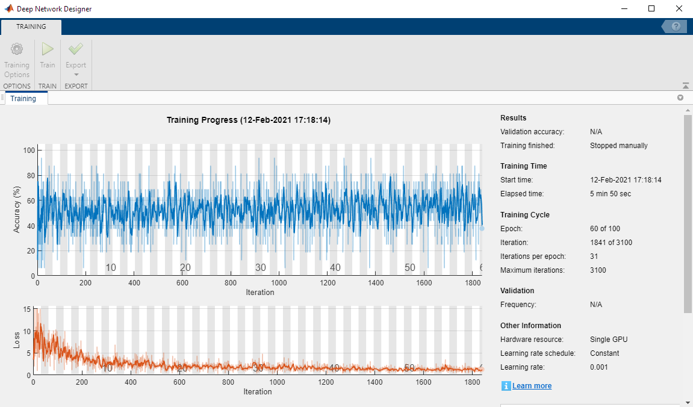

# Training data 


More on [https://github.com/slevin48/gta](https://github.com/slevin48/gta) 


# Data access
## Get images

```matlab:Code
training_dataset = "2021-03-06-1";
training_data_0 = imread("D:\devel\AI-workflow\samples2\"+training_dataset+"\img_0.png");
imshow(training_data_0)
```


```matlab:Code
length(ls("D:\devel\AI-workflow\samples2\"+training_dataset))
```


```text:Output
ans = 352
```


```matlab:Code
i = 1;
training_img = imread("D:\devel\AI-workflow\samples2\"+training_dataset+"\img_"+string(i)+".png");
imshow(training_img)
```


## Get controller data

```matlab:Code
data = readtable("D:\devel\AI-workflow\samples2\"+training_dataset+"\data.csv");
data = renamevars(data,["Var1","Var2","Var3","Var4","Var5","Var6"],["img", "x", "y", "r", "l", "b"]);
data
```

| |img|x|y|r|l|b|
|:--:|:--:|:--:|:--:|:--:|:--:|:--:|
|1|'samples/2021-03-06-...|-0.0157|-0.0079|0|0|0|
|2|'samples/2021-03-06-...|-0.0157|-0.0157|0|0|0|
|3|'samples/2021-03-06-...|-0.0157|-0.0079|0|0|0|
|4|'samples/2021-03-06-...|-0.0157|-0.0079|0|0|0|
|5|'samples/2021-03-06-...|-0.0236|-0.0079|0|0|0|
|6|'samples/2021-03-06-...|-0.0157|-0.0079|0|0|0|
|7|'samples/2021-03-06-...|-0.0157|-0.0079|0|0|0|
|8|'samples/2021-03-06-...|-0.0157|-0.0079|0|0|0|
|9|'samples/2021-03-06-...|-0.0157|-0.0157|0|0|0|
|10|'samples/2021-03-06-...|-0.0157|-0.0079|0.9961|0|0|
|11|'samples/2021-03-06-...|-0.0157|-0.0157|0.9961|0|0|
|12|'samples/2021-03-06-...|-0.0394|-0.0079|0.9961|0|0|
|13|'samples/2021-03-06-...|-0.0709|-0.0157|0.9961|0|0|
|14|'samples/2021-03-06-...|-0.2047|-0.0157|0.9961|0|0|


```matlab:Code
plot(data.x)
```


## Get data from Numpy directly

```matlab:Code
pyenv
```


```matlab:Code
training_dir = uigetdir
% training_dataset"training_data-2021-02-12-2"
% training_dir = "training_data\"+training_dataset
```


```matlab:Code
npfiles = dir(training_dir+"\*.npy")
length(npfiles)
```


```matlab:Code
% npdata = py.training_data.load_data(training_dir+"/X.npy")
```

## Browse training data with an app


## Specify data

```matlab:Code
training_dataset = "2021-03-06-1";
dataFolder = "D:\devel\AI-workflow\samples2\"+training_dataset;
% renameImages(dataFolder); % only need to be run once
imds = imageDatastore(dataFolder);
```

# Modelling
## Aside : what does a pre-trained ACF detector give us ?

```matlab:Code
detector = vehicleDetectorACF('full-view'); % use front-rear-view on highway scenario
vp = vision.VideoPlayer ;

reset(imds);
reset(vp)
while hasdata( imds )
    I = read( imds );
    [bboxes,scores] = detect(detector,I);
    if ~isempty( bboxes )
        I = insertObjectAnnotation(I,'rectangle',bboxes,scores);
    end
    step( vp, I )
    drawnow
end 
```


## Deep Learning


Read in response data and reformat 


```matlab:Code
training_dataset = "training_data-2021-02-14-1";
sequence = 1;
T = readtable("keyboard/"+training_dataset+"/training_data-"+string(sequence)+".csv");
numPoints = size(T, 1);
right = T.D ;
left = T.Q ;
straight = double(~( logical( right) | logical(left) ));
labels = straight + 2*left + 3*right; 
% onehotencode()
imds.Labels = categorical(labels);
```


Resize input data to match network architecture


```matlab:Code
outputSize = [270 480];
auimds = augmentedImageDatastore(outputSize, imds);
```

## Use Deep Network Designer to do transfer learning


In this case, using AlexNet for transfer learning does not work as the training is not converging. We need more data, and also to revisit how the problem is formulated. 





## Helper function

```matlab:Code
function renameImages( dataFolder )

D = dir(dataFolder);
nameRoot = "img_";
for i = 4:numel(D) 
%   1 = .    
%   2 = ..
%   3 = data.csv
    if D(i).isdir == 0
        
        I = imread(fullfile(dataFolder, D(i).name));
        [~,filename,ext] = fileparts(D(i).name);
        nameLength = length( filename );
        if nameLength == 7
            continue;
        else
            if nameLength == 5
                imNumber = ["00" + filename(5)] ;
            elseif nameLength == 6
                imNumber = ["0" + filename(5:6)];                
            end
            newFilename = [nameRoot + imNumber + ext];
            imwrite(I, fullfile(dataFolder, newFilename));
            delete(fullfile(dataFolder, D(i).name));
        end
    end
end
end
```

