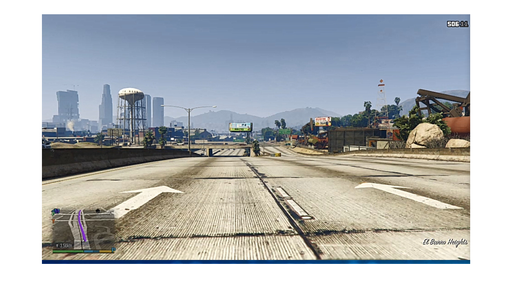
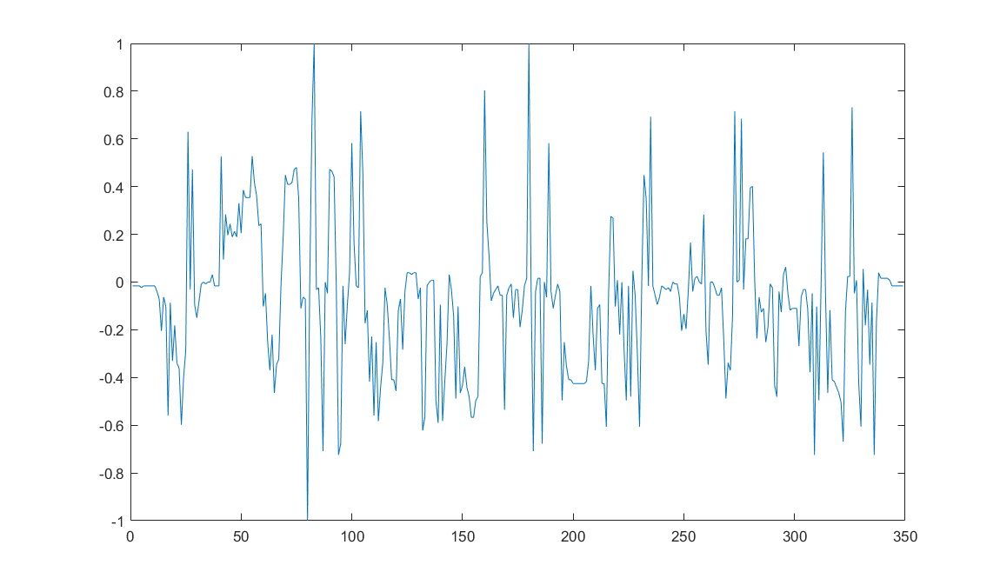
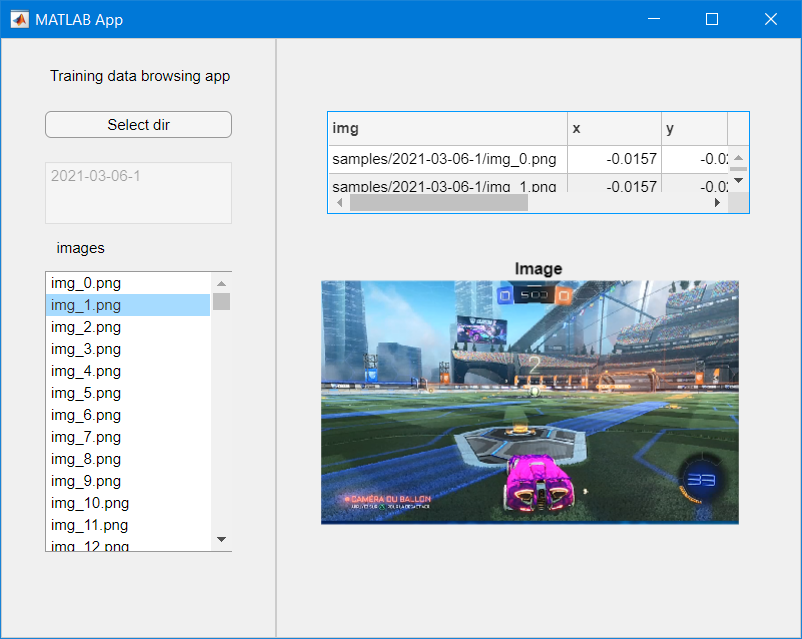
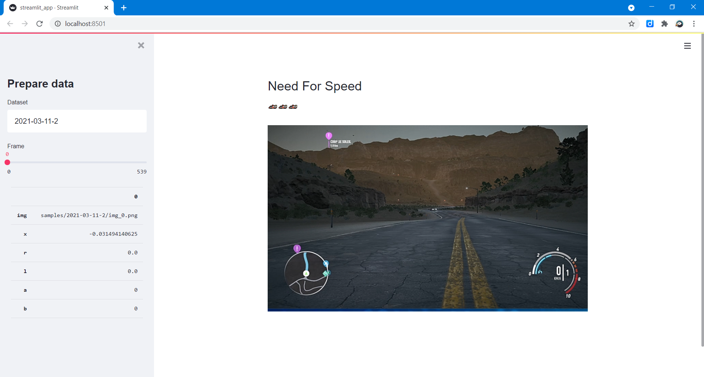
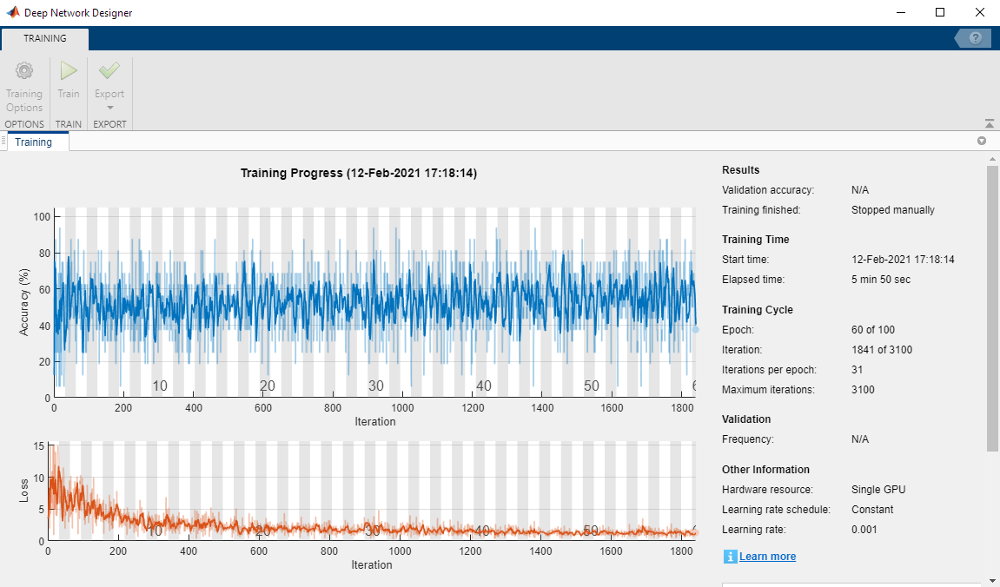
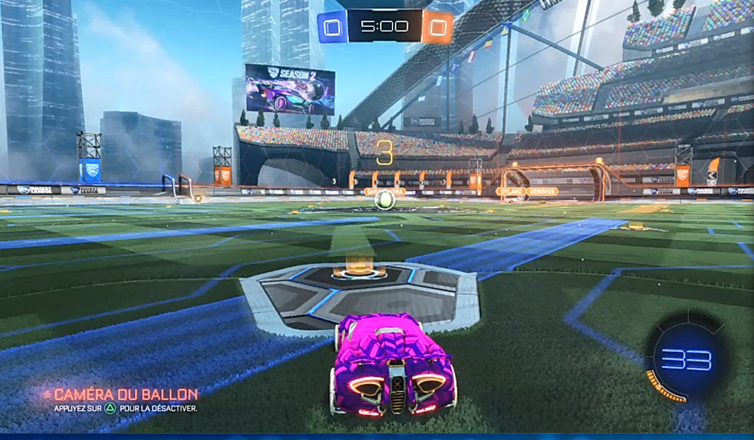

# AI-workflow
🤖 AI workflow: Data access - Preparation - Training - Test


**Content:**
1. [Access data](#access)
2. [Prepare data](#prepare)
3. [Train model](#train)
4. [Test model](#test)


## 1. <a name="access"></a>Access data


**Get images and controller data**

```matlab
training_dataset = "2021-03-06-1";
i = 1;
training_img = imread("D:\devel\AI-workflow\samples2\"+training_dataset+"\img_"+string(i)+".png");
imshow(training_img)
```




```matlab
data = readtable("D:\devel\AI-workflow\samples2\"+training_dataset+"\data.csv");
data = renamevars(data,["Var1","Var2","Var3","Var4","Var5","Var6"],["img", "x", "y", "r", "l", "b"]);
data
```

| |img|x|y|r|l|b|
|:--:|:--:|:--:|:--:|:--:|:--:|:--:|
|1|'samples/2021-03-06-...|-0.0157|-0.0079|0|0|0|
|2|'samples/2021-03-06-...|-0.0157|-0.0157|0|0|0|
|3|'samples/2021-03-06-...|-0.0157|-0.0079|0|0|0|
|4|'samples/2021-03-06-...|-0.0157|-0.0079|0|0|0|
|5|'samples/2021-03-06-...|-0.0236|-0.0079|0|0|0|
|6|'samples/2021-03-06-...|-0.0157|-0.0079|0|0|0|
|7|'samples/2021-03-06-...|-0.0157|-0.0079|0|0|0|
|8|'samples/2021-03-06-...|-0.0157|-0.0079|0|0|0|
|9|'samples/2021-03-06-...|-0.0157|-0.0157|0|0|0|
|10|'samples/2021-03-06-...|-0.0157|-0.0079|0.9961|0|0|


```matlab
plot(data.x)
```



**Record from video game**


*Controller class update* [utils.py](1_access_data/utils.py)
```python
# GTA/Need for Speed
    def read(self):
        x = self.LeftJoystickX
        r = self.RightTrigger
        l = self.LeftTrigger
        a = self.A
        b = self.Y
        return [x, r, l, a, b]
```
## 2. <a name="prepare"></a>Prepare data

**Dataset browsing apps**






## 3. <a name="train"></a>Train model 

**MATLAB Deep Learning toolbox**




## 4. <a name="test"></a>Test model

| |img|x|y|r2|l2|r1|
|:--:|:--:|:--:|:--:|:--:|:--:|:--:|
|1|'samples/2021-03-06-1/img_0.png|-0.015747|-0.023621|0.000000|0.0|0|



```python
>>> joystick = model.predict(vec, batch_size=1)[0]
>>> print(joystick[0])
-0.007983289
```

## Sources
Based on:
* [TensorKart](https://github.com/kevinhughes27/TensorKart)
* [marioKartAI](https://github.com/slevin48/marioKartAI): 🤖AI plays Mario Kart 🏎️
* [gta](https://github.com/slevin48/gta): 🤖 Train a self-driving car in GTA V 🚗
* [rocket](https://github.com/slevin48/rocket): 🚀 AI plays Rocket League ⚽ 🏎️