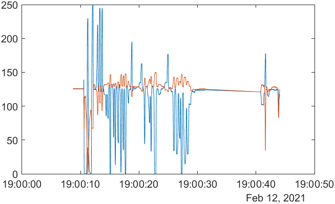
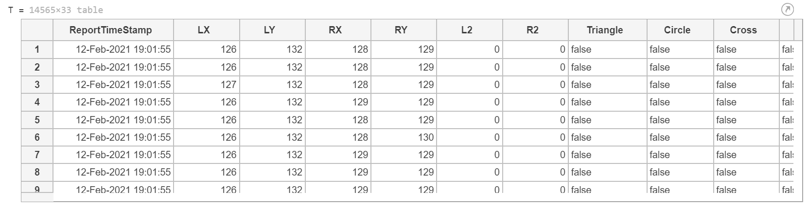
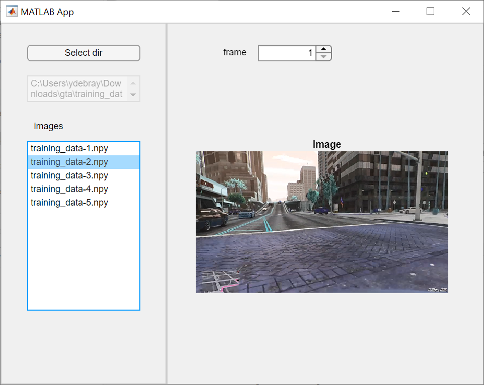

# AI-workflow
🤖 AI workflow: Data access - Preparation - Training - Test

**Content:**
1. [Access data](#access)
2. [Prepare data](#prepare)
3. [Train model](#train)
4. [Test model](#test)

## 1. Access data

Ways to access ipnuts:

* [PyWin32](https://pypi.org/project/pywin32/) to record keyboard
* [PyGame](pygame.org) to access [joystick](https://www.pygame.org/docs/ref/joystick.html) or [keyboard](https://www.pygame.org/docs/ref/key.html)

## 2. Prepare data

**Dataset browsing apps**

## 3. Train model 

**MATLAB Deep Learning toolbox**

